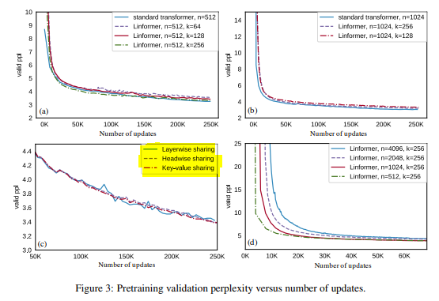

1. The paper experimented using RoBERTa model with linformer's efficient attention mechanism,
but in this implementation, I'm going to use bert training mechanism to re-use the existing module.

2. I used random projection matrix E and K by using the all of the suggested options for efficient learning 
"head-wise sharing" and "key-value sharing" and "layer-wise sharing". Since there was no big difference in experiments from paper Figure (3)

    